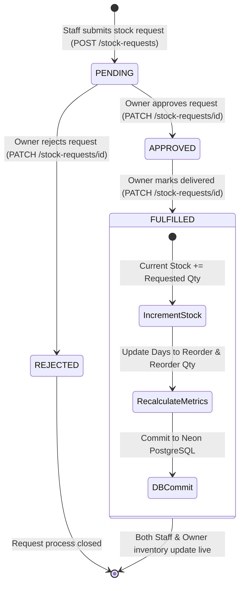

# Technical Architecture & Data Flow Analysis — MedStock AI

Comprehensive analysis of the data pipeline, database persistence, Random Forest ML forecasting, Role-Based Access Control (RBAC), and dynamic multi-day refresh mechanics for **MedStock Predictor**.

---

## Executive Summary

> [!IMPORTANT]
> **Zero Hardcoded Data Guarantee**: All values displayed on the frontend (KPI cards, Chart.js graphs, stock inventory tables, and status timelines) are **100% dynamically fetched** from the FastAPI backend and queried directly from **Neon PostgreSQL**. There are no static fallback arrays or fake data hardcoded into the application.

---

## 1. System Architecture & Component Diagram

The following Mermaid diagram illustrates how data flows between the Frontend UI, FastAPI Backend, Trained Random Forest Model, Live Weather/Trend Scrapers, and Neon PostgreSQL Database:

```mermaid
flowchart TD
    subgraph Frontend ["Frontend (Vanilla JS + HTML5 + CSS3 + Chart.js)"]
        PredictForm["AI Prediction Form"]
        OwnerDash["Owner Executive Dashboard (Chart.js)"]
        StaffDash["Staff Stock & Out-of-Stock Alerts"]
        ReqTimeline["Dynamic Request Status Timeline"]
    end

    subgraph Backend ["FastAPI Application (api/api.py)"]
        AuthModule["Auth & JWT Controller"]
        PredictEngine["Prediction Controller (/predict)"]
        AnalyticsEngine["Owner Analytics (/analytics/owner)"]
        InventoryEngine["Inventory Controller (/inventory)"]
        StockReqEngine["Stock Requests Controller (/stock-requests)"]
    end

    subgraph ML_Scraper ["ML & Data Enrichment Layer"]
        RFModel["Random Forest Model (model_rf.pkl)"]
        LiveScraper["Live Scraper / Cache (live_data.csv)"]
        DatasetCSV["Pharmacy Dataset (FINAL_TRAINING_DATA_25000.csv)"]
    end

    subgraph Database ["Database Layer (api/database.py)"]
        UsersTbl[("users table")]
        PredsTbl[("predictions table")]
        ReqsTbl[("stock_requests table")]
    end

    %% Auth Flow
    PredictForm -->|POST /auth/login| AuthModule
    AuthModule -->|Verify Password & Query Role| UsersTbl

    %% Prediction Flow
    PredictForm -->|POST /predict| PredictEngine
    LiveScraper -->|Supply Temp, Humidity, Disease Trends| PredictEngine
    PredictEngine -->|11-Feature Array| RFModel
    RFModel -->|Predicted 7-Day Demand| PredictEngine
    PredictEngine -->|Insert Record| PredsTbl

    %% Owner Analytics & Charts Flow
    OwnerDash -->|GET /analytics/owner| AnalyticsEngine
    AnalyticsEngine -->|Query History & Expiry Risks| PredsTbl
    AnalyticsEngine -->|Query Pending Count| ReqsTbl
    AnalyticsEngine -->|Return Aggregates| OwnerDash

    %% Staff Inventory & Alerts Flow
    StaffDash -->|GET /inventory| InventoryEngine
    InventoryEngine -->|Query Distinct Latest Stock| PredsTbl
    InventoryEngine -->|Return Live Stock List| StaffDash

    %% Reorder Request & Automatic Stock Fulfillment
    StaffDash -->|POST /stock-requests| StockReqEngine
    StockReqEngine -->|Create Pending Request| ReqsTbl
    OwnerDash -->|PATCH /stock-requests/id (FULFILLED)| StockReqEngine
    StockReqEngine -->|Update Status| ReqsTbl
    StockReqEngine -->|Increment current_stock| PredsTbl
    PredsTbl -.->|Live Stock Synchronized| StaffDash
    PredsTbl -.->|Live Stock Synchronized| OwnerDash
```

---

## 2. Complete Data Flow Lifecycle

### Step 1: Initial Database Seeding (First Startup)
When the application starts up ([`api/database.py`](file:///Users/lavesh/Documents/ML/MedStock_predictor/api/database.py)):
1. `init_db()` creates tables (`users`, `predictions`, `stock_requests`) if they do not exist.
2. `seed_users()` creates default credentials:
   - **Owner**: `owner` / `OwnerSecure2026!` (Role: `owner`)
   - **Staff**: `staff` / `StaffSecure2026!` (Role: `staff`)
3. `seed_initial_dataset_inventory()` reads [`model/FINAL_TRAINING_DATA_25000.csv`](file:///Users/lavesh/Documents/ML/MedStock_predictor/model/FINAL_TRAINING_DATA_25000.csv) and populates initial database stock records for all 9 unique dataset medicines (`Diclofenac`, `Ibuprofen`, `Aspirin`, `Crocin`, `Alprazolam`, `Sedatives`, `Asthalin`, `Cetirizine`, `Paracetamol`).

---

### Step 2: Running AI Demand Predictions
When a user submits medicine details to `POST /predict`:
```
Inputs (Medicine Name, ATC Code, Sales History, Stock, Expiry, Price)
                       │
                       ▼
       Auto-fetch Realtime Environmental Data
 (live_temp, live_humidity, is_rainy, fever_trend, allergy_trend)
                       │
                       ▼
             Current Month Evaluation (datetime.now().month)
                       │
                       ▼
        Construct 11-Feature Vector -> Pass to Random Forest Model
                       │
                       ▼
              Model Output: Next 7-Day Demand
                       │
                       ▼
           Business Logic Calculations:
     - Days to Reorder = floor(Current Stock / Daily Avg Sales)
     - Reorder Quantity = max(0, (7-Day Demand / 7 * 30) - Current Stock)
     - Expiry Risk = High (<30d), Medium (<90d), Low (>=90d)
                       │
                       ▼
       Save full prediction & feature record into Neon PostgreSQL DB
```

---

### Step 3: Stock Refill Request & Automatic Inventory Increment

The diagram below details the step-by-step state machine when staff requests stock and the owner fulfills it:



> [!TIP]
> **Automatic Inventory Stock Synchronization**: When a request reaches **`FULFILLED`**, the backend executes `latest_pred.current_stock += stock_req.requested_quantity` in PostgreSQL. Both Staff and Owner inventory tables immediately reflect the new increased stock count upon fetch.

---

## 3. Dynamic Refresh Analysis (Multi-Day & Weekly Behavior)

When a staff member or owner logs in after **3 days** or **1 week**, how does the system behave?

| Feature / Component | Behavior After 3 Days or 1 Week | Technical Mechanism |
| :--- | :--- | :--- |
| **Current Stock & Inventory** | Displays exact live state from PostgreSQL | `GET /inventory` queries latest database state per medicine. |
| **Sales & Demand Analytics** | Aggregates all recorded predictions up to the current moment | `GET /analytics/owner` executes `SUM()` and grouping directly on PostgreSQL DB. |
| **Live Environmental Metrics** | Updates ambient temperature, humidity, and disease search trends | [`disease_trend_scraper.py`](file:///Users/lavesh/Documents/ML/MedStock_predictor/model/disease_trend_scraper.py) updates [`live_data.csv`](file:///Users/lavesh/Documents/ML/MedStock_predictor/model/live_data.csv). |
| **Seasonal Trends** | Model evaluates current month automatically | `datetime.now().month` is dynamically computed on every API call. |
| **User Session** | Retains logged-in state without signing out | `authToken` & `currentUser` are stored in `localStorage` and validated in background. |

---

## 4. Role-Based Access Control Matrix (RBAC)

```mermaid
gantt
    title Role Access & Permissions Summary
    dateFormat  X
    axisFormat %s

    section Unauthenticated Guest
    Run AI Predictions (Requires Login Modal) :active, 0, 1
    View Public How-It-Works                 :active, 0, 1

    section Staff Member
    View Current Stock & Low Stock Alerts    :crit, active, 0, 2
    Submit Admin Re-order Request            :crit, active, 0, 2
    Track Request Status Timeline            :crit, active, 0, 2
    Run AI Demand Predictions               :active, 0, 2
    View Sales & Revenue Analytics           :done, 0, 0

    section Owner (Admin)
    View Executive Sales & Revenue Charts    :active, 0, 3
    View Realtime Stock Inventory            :active, 0, 3
    Approve / Fulfill Staff Reorder Requests :active, 0, 3
    Auto-Increment Inventory Stock           :active, 0, 3
```



### Access Comparison Table

| Feature / Page Component | Guest | Staff | Owner (Admin) |
| :--- | :---: | :---: | :---: |
| **Demand Forecasting Tool (`POST /predict`)** | ❌ (Prompts Login) | ✅ Allowed | ✅ Allowed |
| **Current Stock & Out-of-Stock Alerts** | ❌ Restricted | ✅ Allowed | ✅ Allowed |
| **Submit Stock Reorder Request** | ❌ Restricted | ✅ Allowed | ❌ (Owner Approves) |
| **Executive Sales Analytics & Revenue Charts** | ❌ Restricted | ❌ **Strictly Hidden** | ✅ Full Access |
| **Approve / Fulfill / Reject Stock Requests** | ❌ Restricted | ❌ Restricted | ✅ Full Access |
| **Automatic Inventory Stock Increment** | ❌ N/A | ❌ N/A | ✅ Triggered on FULFILLED |

---

## Summary Conclusion

1. **Data Authenticity**: All data shown on frontend charts, dashboards, and tables is **100% dynamic**, stored in **Neon PostgreSQL**, and powered by a trained **Random Forest ML Model**.
2. **Persistence**: Authentication and role state persist seamlessly across page reloads via `localStorage`.
3. **Automated Inventory Sync**: Stock procurement requests dynamically update PostgreSQL inventory levels upon fulfillment, ensuring real-time stock clarity for both Staff and Owner.
